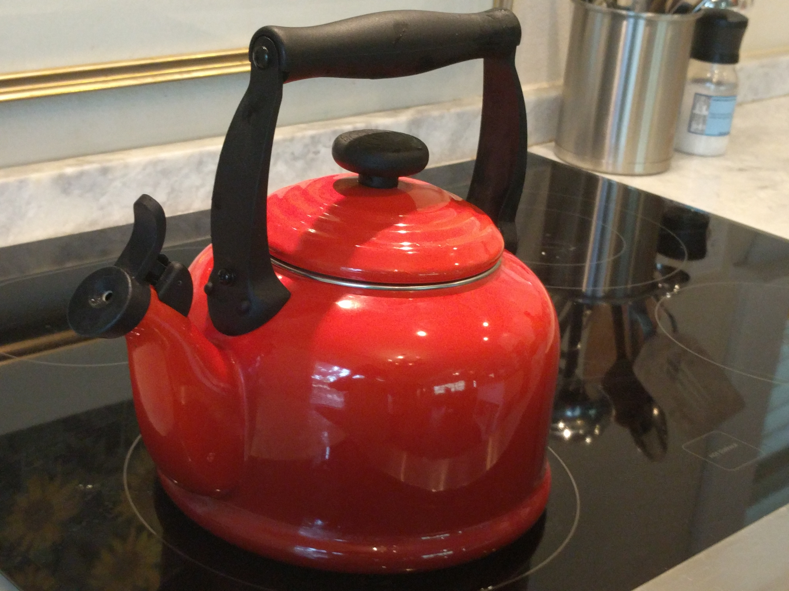

[](README.md)
# teapot
An implementation of an RFC 7168 compliant server via PHP.

# Instructions
  1. Get the dependencies:
    - PHP from <https://secure.php.net/downloads.php>
    - IPv6 Address from <http://ipv6.com/articles/general/IPv6-Addressing.htm>
  2. Run the following commands
  
  ```shell
  git clone https://github.com/EtherTyper/teapot.git # Get the code
  cd teapot # Open the code
  php -S localhost:8768 # Initialize the server at port TPOT
  ```
  3. Open a browser, e.g. Chrome to one of the following:
    - <localhost:8768/>
    - <localhost:8768/index.php>

Have fun!

## Notice
_**Please**_ don't report 418 ("I'm a teapot.") errors in your server. This usually means your teapot (or teapot-imitating VPN) doesn't support the newest iteration of RFC 7168. If you believe this is the case, please contact the original manufacturer of your teapot on upgrading its Hyper Text Transfer Protocol support. There is no warranty or guarentee that our server will work on your teapot.
